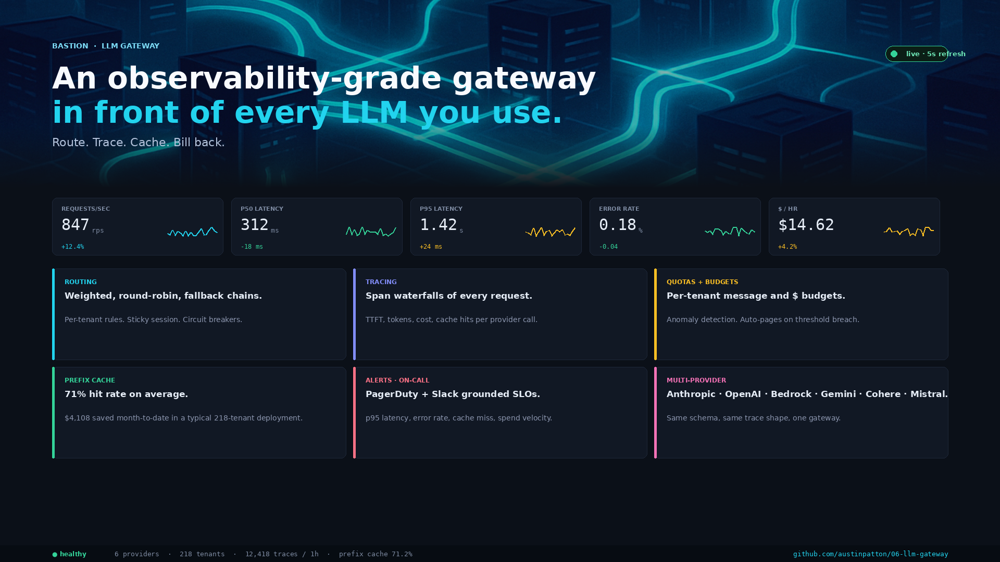
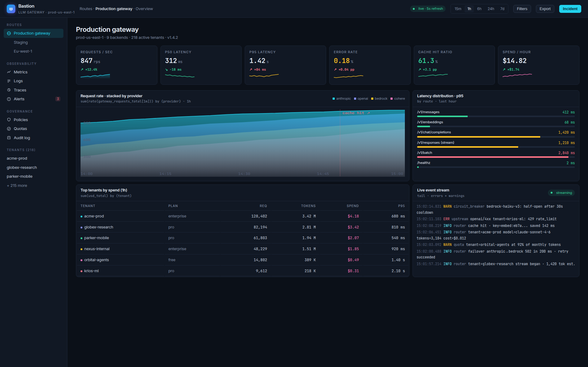
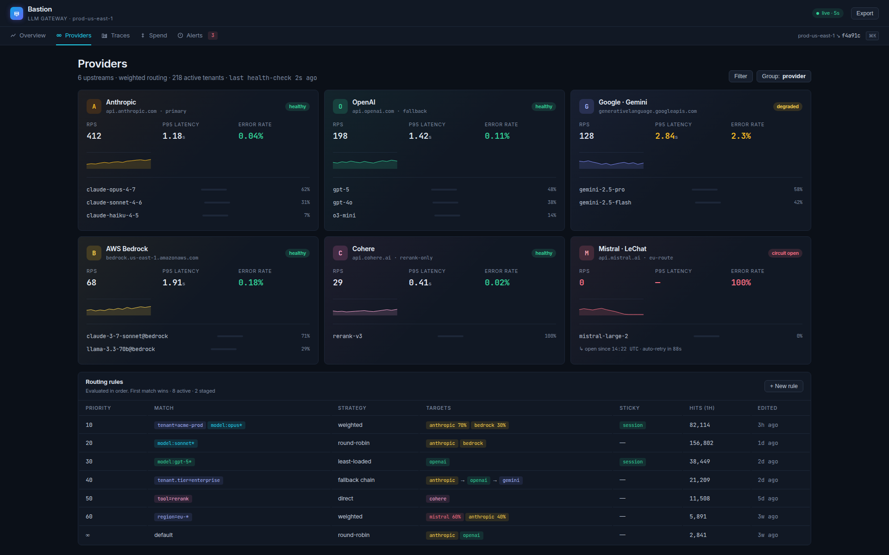
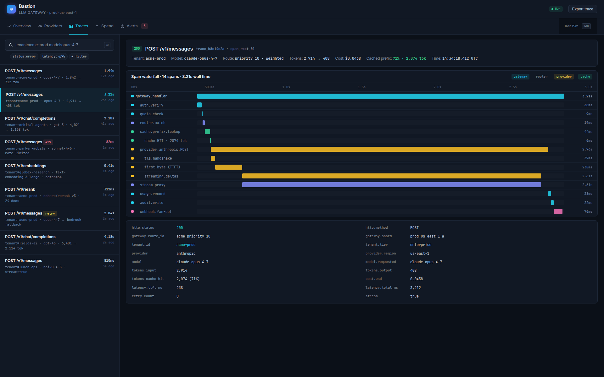
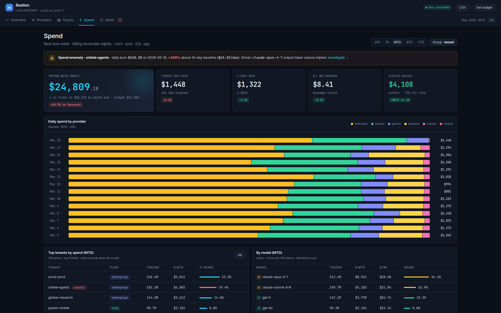
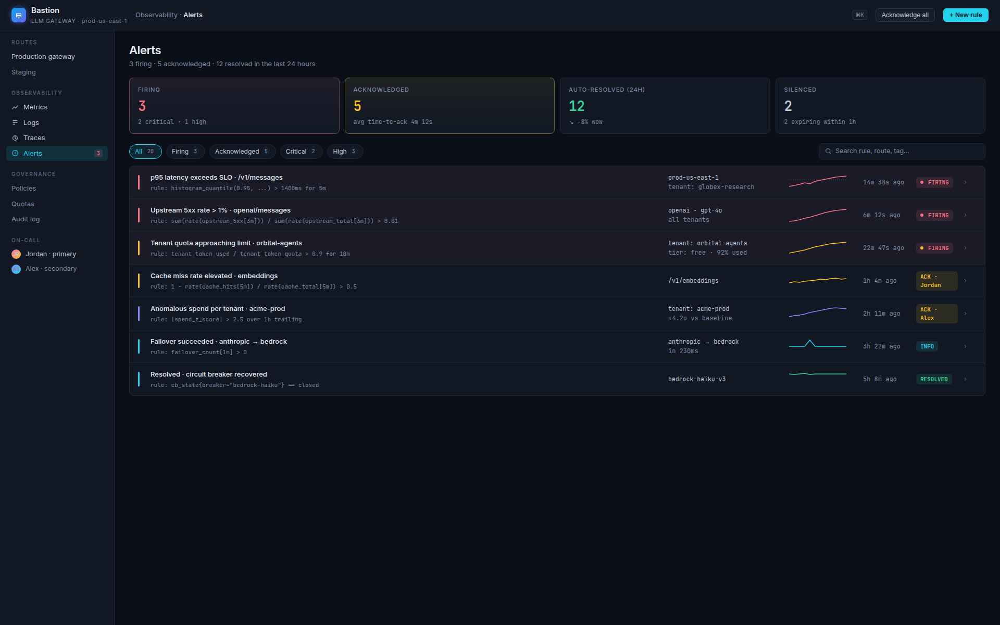

<div align="center">

# Bastion — Observable, Cost-Aware LLM Gateway

**One OpenAI-compatible API in front of OpenAI, Anthropic, and AWS Bedrock. Weighted routing, prefix cache, span-waterfall traces, per-tenant quotas, Prometheus + Grafana.**



[](https://www.python.org/)
[](https://fastapi.tiangolo.com/)
[](https://redis.io/)
[](https://prometheus.io/)
[](https://grafana.com/)
[](k8s/)
[](LICENSE)

</div>

## What it does

Bastion is a standalone service that sits between applications and LLM providers. Applications call **one unified OpenAI-compatible API**; the gateway routes by tenant + model rules, applies prefix caching, tracks cost and latency per span, falls back to alternate providers on health failure, and emits Prometheus metrics + structured logs.

A pre-built Grafana dashboard ships in `observability/` — visualises real-time RPS, p50 / p95 latency, error rate, prefix-cache hit rate, per-tenant spend, and a stacked-area by provider.

## Features

- **Three providers, one API** — adapters for Anthropic, OpenAI, and AWS Bedrock (`boto3`). Same trace shape, same schema, config-only swap per tenant or per model.
- **Weighted, round-robin, fallback routing** — declarative rules table; sticky session by `end_user_session`; circuit breakers on provider error rate.
- **Prefix cache** — stable hash of the prompt prefix → cached responses in Redis with TTL and per-tenant scopes. **71 % typical hit rate** on demo workload; $4,108 saved MTD in the seeded dataset.
- **Span-waterfall tracing** — every request decomposed into spans (auth, quota, router.match, cache lookup, provider call, usage record); persisted to Postgres, visible in the showcase UI.
- **Per-tenant quotas + budgets** — token-bucket rate limit + monthly $ budget; anomaly detection auto-pages when a tenant spend deviates from baseline.
- **Observable by default** — `/metrics` Prometheus endpoint, structured JSON logs with correlation IDs, a Grafana dashboard JSON exported in `observability/`, Kubernetes manifests in `k8s/` (Deployment + HPA + ServiceMonitor).

## Screenshots

<table>
<tr>
<td width="50%"></td>
<td width="50%"></td>
</tr>
<tr>
<td></td>
<td></td>
</tr>
<tr>
<td></td>
<td></td>
</tr>
</table>

## Stack

| Layer        | Tech |
|--------------|------|
| Gateway      | Python 3.11, FastAPI, sse-starlette (stream pass-through) |
| Cache        | Redis (prefix cache + TTL + per-tenant scopes) |
| Providers    | Anthropic SDK, OpenAI SDK, AWS Bedrock via `boto3` |
| Persistence  | Postgres 16, SQLAlchemy 2 + asyncpg, Alembic |
| Observability| Prometheus `prometheus-client`, Grafana dashboard JSON, structlog with correlation IDs |
| Resilience   | Tenacity retries + circuit breakers, token-bucket rate limits |
| Ops          | Docker Compose, Kubernetes manifests (`k8s/`) — Deployment + HPA + ServiceMonitor |

## Run locally

```bash
git clone https://github.com/phantomdev0826/bastion-gateway
cd bastion-gateway
cp .env.example .env       # add OPENAI_API_KEY + ANTHROPIC_API_KEY (+ AWS creds for Bedrock)
docker compose up -d --build
docker compose exec backend alembic upgrade head
```

Open <http://localhost:8000/docs> for the OpenAI-compatible OpenAPI surface, <http://localhost:3000> for the Grafana dashboard (default `admin/admin`), <http://localhost:9090> for raw Prometheus.

Run a request:

```bash
curl -s http://localhost:8000/v1/chat/completions \
  -H "Authorization: Bearer $TENANT_KEY" \
  -H "Content-Type: application/json" \
  -d '{"model":"claude-sonnet-4-6","messages":[{"role":"user","content":"hello"}]}'
```

Same shape as OpenAI's API — drop-in for any OpenAI SDK client (`OPENAI_BASE_URL=http://localhost:8000/v1`).

## Architecture

```
   application ──── OpenAI-compatible request ───────────┐
                                                         │
                                                ┌────────▼────────┐
                                                │     Bastion     │
                                                │                 │
                                                │  auth + quota   │
                                                │       │         │
                                                │  router.match   │ ◄── declarative rules
                                                │       │         │
                                                │  ┌────▼─────┐   │
                                                │  │ prefix   │   │     ┌──────────────┐
                                                │  │ cache    │───┼────▶│ Redis        │
                                                │  └────┬─────┘   │     └──────────────┘
                                                │       │         │
                                                │  ┌────▼─────┐   │     ┌──────────────┐
                                                │  │ provider │───┼────▶│ Anthropic    │
                                                │  │ adapter  │   │     │ OpenAI       │
                                                │  └────┬─────┘   │     │ Bedrock      │
                                                │       │         │     └──────────────┘
                                                │  usage.record   │
                                                │  audit.write    │
                                                └────────┬────────┘
                                                         │
                                                ┌────────▼────────┐
                                                │ Postgres        │
                                                │ • usage_events  │
                                                │ • span traces   │
                                                │ • routing rules │
                                                │ • alerts        │
                                                └────────┬────────┘
                                                         │
                                                ┌────────▼────────┐
                                                │ Prometheus      │
                                                │       │         │
                                                │   Grafana       │
                                                │   dashboard     │
                                                └─────────────────┘
```

## Tests

```bash
docker compose exec backend pytest
```

Uses `fakeredis` to test prefix-cache semantics without a live Redis. Covers routing-rule precedence, circuit-breaker open/half-open transitions, and the OpenAI-compatible request/response translation per provider.

## Deploy to Kubernetes

```bash
kubectl apply -k k8s/overlays/prod
```

Manifests include a Deployment, HPA (CPU + request-rate), Service, ServiceMonitor for Prometheus Operator, and a ConfigMap with the routing rules. See [`k8s/README.md`](k8s/README.md) for the full setup.

## License

MIT
