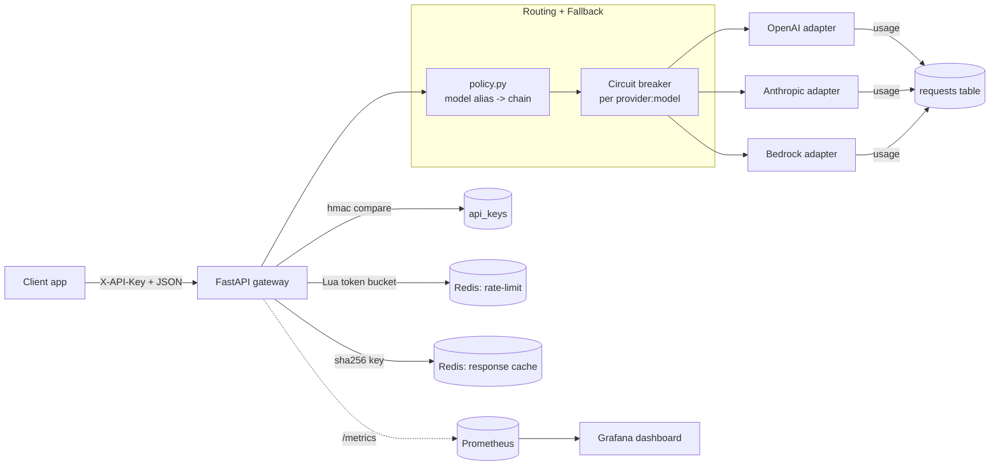

# Architecture

## Request lifecycle

1. **Auth** — `X-API-Key` constant-time compared against the configured set; the dependency returns the *hash* of the accepted key so downstream code never sees the raw key.
2. **Rate limit** — atomic Lua token-bucket in Redis keyed by the API-key hash. Bucket cost scales with `max_tokens` so a 4k-token request consumes more bucket than a 200-token one. Multi-pod deployments share one bucket per key.
3. **Cache lookup** — only when `temperature <= CACHE_TEMP_THRESHOLD` (default 0). Key = `sha256(provider, model, messages, max_tokens, temperature_4dp)`. On HIT the gateway returns immediately and the request still gets a row in `requests` with `cache_hit=true` and `cost_usd=0` so cumulative cost remains accurate.
4. **Routing** — model alias (`default-fast`, `default-smart`, or `provider:model`) resolves to an ordered list of `(provider, model)` candidates.
5. **Fallback** — try each candidate in order. A candidate is skipped if its circuit is open. `ProviderUnavailableError` from an adapter (missing creds, 5xx, timeout) records a failure on the breaker and falls through to the next candidate. After N consecutive failures the breaker opens for `cooldown` seconds.
6. **Persist + metrics** — every request (success, fallback, total failure) writes a `requests` row and increments Prometheus counters / histograms.

## Why a Lua-script token bucket

Token-bucket math (`tokens = min(cap, tokens + elapsed * refill); allow = tokens >= cost`) needs to be atomic to be correct under concurrency. Redis pipelines don't guarantee atomicity across multiple commands; a Lua script does. The script also returns a precise `Retry-After` value so 429 responses are actionable.

## Cache strategy

Caching responses is only safe for deterministic inputs. The gateway enforces this with `CACHE_TEMP_THRESHOLD` (default 0.0) — any request with `temperature > threshold` skips both the lookup and the write. For deterministic prompts the cache hit rate can climb past 60% on representative workloads (the `load_test.py` mix demonstrates this).

The cache key explicitly *excludes* the API key — different tenants asking the same question share cache entries. That's the right trade for cost (and the data is never user-specific in this context), but be deliberate if you fork this for a privacy-sensitive deployment.

## Cost as a first-class metric

Every successful call computes USD cost from `PRICE_TABLE[(provider, model)]` (input + output rates per million tokens). Cost is recorded:

- in `requests.cost_usd` for SQL-side rollups and per-key invoicing
- in the `gateway_request_cost_usd_total` Prometheus counter for the Grafana dashboard

Cache HITs are zero-cost; that's what makes the cache hit rate panel directly map to dollars saved.

## What the Grafana dashboard shows

| Panel                           | What it tells you                                 |
| ------------------------------- | ------------------------------------------------- |
| Requests/sec                    | Total throughput                                  |
| Cache hit rate                  | % of requests served from Redis                   |
| Cost (1h)                       | Live spend; tracks closely with provider invoices |
| Open circuits                   | Provider outages in progress                      |
| Latency p50/p95/p99 by provider | Which upstream is slow                            |
| Gateway overhead (miss path)    | Time spent *inside* the gateway, not upstream     |
| Requests by provider+model      | Where traffic actually lands after routing        |
| Failure rate by provider        | Upstream reliability                              |
| Tokens prompt vs completion     | Usage shape                                       |
| Cost by provider                | Spend attribution                                 |
